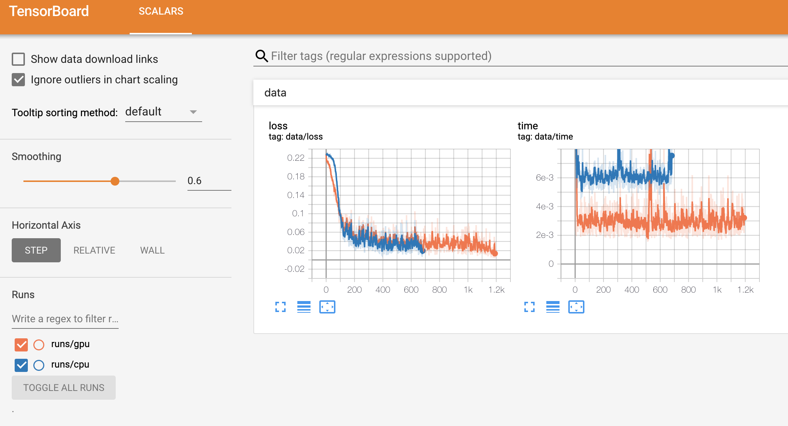

## Distributed tensorflow using gpu Tutorial

* Compare time to operate small neural network (w gpu, w/o gpu)
* task : MNIST prediction

## Dependency

```
tensorflow-gpu==1.14.0
```

## How to Run

```
python trainer.py --job_name=learner -> with gpu
python trainer.py --job_name=actor   -> without gpu
```

## Result

<div align="center">
  
</div>